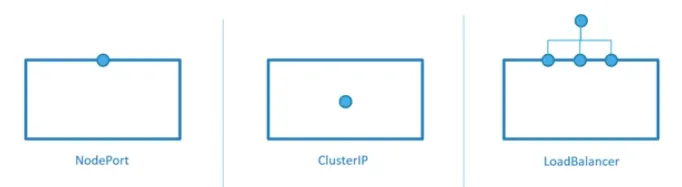

# Kubernetes Service

This guide explains **Kubernetes Service** in the simplest possible way.

We will follow this order:
1. Scenario (real problem)
2. Why Pods alone are not enough
3. What a Service is
4. Simple Service example
5. How traffic flows
6. Types of Services (high-level)
7. Key takeaways

---

# Read the below blog 
- [What is Kubernetes Service and How it works?](https://medium.com/@sanoj.sudo/what-is-kubernetes-services-and-how-it-works-92589a161e61)


## 📄 Step 1: Pod with Labels

Service works using labels.
```yaml
apiVersion: v1
kind: Pod
metadata:
  name: nginx-pod
  labels:
    app: web
spec:
  containers:
  - name: nginx
    image: nginx
    ports:
    - containerPort: 80
```

## 📄 Step 2: Create a Service
```yaml
apiVersion: v1
kind: Service
metadata:
  name: web-service
spec:
  selector:
    app: web
  ports:
  - port: 80
    targetPort: 80
```

### 🔍 What This Service Does

- **selector** → finds Pods with **app=web**
- **port** → Service port
- **targetPort** → container port

Result:

- Service automatically routes traffic to the Pod

### 🧠 Traffic Flow (Very Important)
```
Request
  |
  v
Service (web-service)
  |
  v
nginx-pod
```

If Pod restarts:

- New Pod IP
- Same label
- Service continues working

✔ No change needed

## Types of services

- 