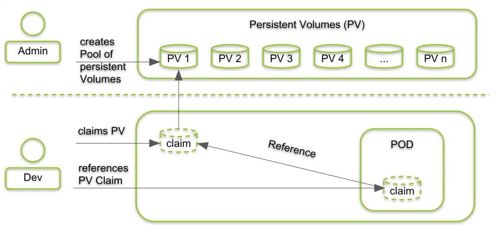

## 1️⃣ Scenario (Real Problem)

You are running:

- MySQL
- PostgreSQL
- MongoDB
- Any app storing user data

What happens today:

- Pod restarts ❌
- Pod moves to another node ❌
- Node crashes ❌

👉 Data must survive ALL of this

But:

- emptyDir ❌
- hostPath ❌
- ConfigMap / Secret ❌

You need real persistent storage.



---
### What is a PersistentVolume (PV)?

>A PersistentVolume is a cluster-level storage resource.

Think of it as:

>🗄️ A disk already created and registered with Kubernetes

Characteristics:

- Created by admin
- Lives independent of Pods
- Can be backed by:
  - Cloud disks
  - NFS
  - iSCSI
  - CSI drivers

📌 PV is NOT tied to any Pod

### What is a PersistentVolumeClaim (PVC)?

>A PVC is a request for storage made by an application.

Think of it as:

>📝 “I need 10Gi storage, ReadWriteOnce”

Characteristics:

- Created by developer
- Requests size + access mode
- Binds to a matching PV

📌 App never talks to PV directly
📌 App talks only to PVC

---
## Example

### Simple PV Example
```yaml
apiVersion: v1
kind: PersistentVolume
metadata:
  name: pv-demo
spec:
  capacity:
    storage: 5Gi
  accessModes:
    - ReadWriteOnce
  persistentVolumeReclaimPolicy: Retain
  hostPath:
    path: /mnt/data
```

📌 This is just for learning (hostPath PV is not prod)
### Simple PVC Example
```yaml
apiVersion: v1
kind: PersistentVolumeClaim
metadata:
  name: pvc-demo
spec:
  accessModes:
    - ReadWriteOnce
  resources:
    requests:
      storage: 5Gi
```

If:

- PV has ≥ 5Gi
- AccessMode matches

👉 PVC binds to PV automatically ✅

### Using PVC in a Pod
```yaml
apiVersion: v1
kind: Pod
metadata:
  name: pvc-pod
spec:
  containers:
  - name: app
    image: busybox
    command: ["sh", "-c", "echo hello > /data/msg.txt; sleep 3600"]
    volumeMounts:
    - name: data-volume
      mountPath: /data

  volumes:
  - name: data-volume
    persistentVolumeClaim:
      claimName: pvc-demo
```

📌 Pod mounts PVC, not PV
📌 PVC abstracts storage details

--- 

### How data REALLY flows
```
Application writes data
        ↓
Mounted PVC (/data)
        ↓
Bound PV
        ↓
Actual Storage (Disk / NFS / Cloud)
```

✔️ Pod deleted → data stays
✔️ Pod recreated → data reattached

1️⃣1️⃣ Access Modes (VERY IMPORTANT)
| Access Mode      | Meaning                          |
|------------------|----------------------------------|
| ReadWriteOnce    | Mounted as read-write by one node |
| ReadOnlyMany     | Mounted as read-only by many nodes|
| ReadWriteMany    | Mounted as read-write by many nodes|

> Access modes are enforced at the **node level**, not per Pod.
Meaning:

- Multiple Pods on the same node can use ReadWriteOnce
- But Pods on different nodes cannot

---
## ♻️ Reclaim Policies — Visual Diagram
### 🧱 Common Base Flow (Same for all policies)
```
Pod
 ↓
PVC  (you delete this ❌)
 ↓
PV   (has reclaimPolicy)
 ↓
Actual Storage (Disk)
```

>**The ONLY difference is what happens to the disk after PVC deletion**

🟢 1️⃣ Retain — KEEP THE DATA
```
Before PVC deletion:
Pod → PVC → PV → Disk (DATA ✅)

Delete PVC ❌

After PVC deletion:
PVC ❌
PV (Released)
Disk (DATA STILL EXISTS ✅)
```
Meaning (plain English)

- PVC gone, but disk + data are safe.

### 2️⃣ Delete — DELETE EVERYTHING
```
Before PVC deletion:
Pod → PVC → PV → Disk (DATA ✅)

Delete PVC ❌

After PVC deletion:
PVC ❌
PV ❌
Disk ❌
(DATA LOST ❌)
```

Meaning (plain English)

- PVC gone → disk gone → data gone.

### 3️⃣ Recycle — OLD / DEPRECATED
```
Before PVC deletion:
Pod → PVC → PV → Disk (DATA ✅)

Delete PVC ❌

After PVC deletion:
PVC ❌
PV reused (cleaned)
Disk data wiped ❌
```

## example:
```yaml
apiVersion: v1
kind: PersistentVolume
metadata:
  name: pv-delete
spec:
  capacity:
    storage: 5Gi
  accessModes:
    - ReadWriteOnce
  persistentVolumeReclaimPolicy: Delete
  awsElasticBlockStore:
    volumeID: vol-0abcd1234
    fsType: ext4
```
---

## Static vs Dynamic Provisioning
### Static (old way)

- Admin creates PV manually
- PVC binds to existing PV

### Dynamic (modern way)

- PVC created
- Kubernetes auto-creates PV
- Uses StorageClass

---
### 🎯 Interview One-Liner

- ReadWriteOnce allows a volume to be mounted by a single node, ReadOnlyMany allows multiple nodes to read, and ReadWriteMany allows multiple nodes to read and write simultaneously.

### 🎯 Interview One-Liner (Say This)

- Reclaim policy controls what happens to the underlying storage when a PVC is deleted—Retain keeps the data, Delete removes the storage, and Recycle is deprecated.